# Library Management System  Security Documentation

## Kort sammanfattning av security design:
Applikationen använder STATELESS session policy med JWT-baserad autentisering för REST API:er.
Access-tokens har kort TTL (15 min) och refresh-tokens 24h.  
Lösenord lagras hashat med BCrypt. Känsliga fält (t.ex. personnummer) krypteras i databasen med AES via en JPA AttributeConverter.
Login-rate limiting och account lockout finns för att reducera brute-force-risker.  
Säkra HTTP-headers (HSTS, CSP, X-Frame-Options) är konfigurerade.

## Förklara JWT vs sessions: fördelar, nackdelar och när man använder vad 
- JWT används här eftersom applikationen är API-driven med stateless arkitektur för skalbarhet.
- **Sessions (Server-side State)**   
server skapar session-ID, lagrar sessionsdata och skickar cookie (JSESSIONID) till klienten.
    - **Fördelar:**   
     - Direkt kontroll över sessionsgiltighet
     - Enkel revokering av åtkomst
     - Serverbaserad säkerhetskontroll  
  
    - **Nackdelar:**   
      - Kräver sessionstore vilket ger sämre skalbarhet 
      - Server-state måste synkas
      - Mindre lämpat för API/Mobil  
      
- **JWT Tokens (Stateless)**:  
  Server signerar JSON Web Token med användarinfo och roller, klienten skickar token i Authorization header.
  - **Fördelar:** 
    - Skalbart, ingen sessionstore
    - Bätttre för API och mobil
    - Roller inkluderade, self contained
  - **Nackdelar**:  
    - Svårare att revokera åtkomst direkt
    - Tokenstöld ger tillgång tills token gått ut
    - kräver säker nyckel

---

## Dokumentera er threat model och vilka hot ni skyddar mot
### Threat Model
- **skyddade tillgångar**   
  -  Användarkontin och lösenord som hashats med BCrypt  
  - JWT access token och refresh tokens   
  - personuppgifter kryption (email, AES-krypterat SSN)  
  - Bok- och lånedata
  
### Identifierade Hot & Skydd
- **Brute Force-attacker**  
  - Skydd: LoginAttemptService (max 5 försök/minut + 15 min lockout)  
  - Implementering: Email-baserad spårning med rullande tidsfönster  

- **Token-stöld och replay**  
  - Skydd: Kort TTL (15 min access tokens) + TokenBlacklist vid logout  
  - Implementering: In-memory blacklist med automatisk cleanup  

- **XSS Cross-Site Scripting**  
  - Skydd: Input sanering med JSoup + Content Security Policy headers  
  - Implementering: Jsoup.clean() på all användarinput  

- **SQL Injection**  
  - Skydd: Spring Data JPA med parameteriserade queries  
  - Implementering: Endast :param binding i native queries  

- **API Spam/DoS**  
  - Skydd: ApiRateLimitFilter (20 requests/minut per IP)  
  - Implementering: IP + endpoint-baserad rate limiting  

---

## Beskriv säkerhetsarkitekturen och designbeslut  
### Säkerhetsarkitektur  
- **Autentiseringsflöde:**  
1. Login &rarr; JwtUtil validerar &rarr; JWT access + refresh tokens
2. Request &rarr; JwtAuthenticationFilter &rarr; Token validation &rarr; SecurityContext
3. Controller &rarr; @PreAuthorize &rarr; Business logic
4. Logout &rarr; Token blacklist &rarr; Omedelbar invalidering

- **Lagervisad Säkerhet**
  - Filter-nivå: JWT validation, rate limiting  
  - SecurityConfig: URL-baserad rollkontroll  
  - Controller-nivå: @PreAuthorize metodskydd  
  - Service-nivå: affärs logic och validation  
  - Data-nivå: BCrypt lösenord + AES SSN-kryptering   

- **HTTP Säkerhetsheaders**  
  - HSTS: Tvingar HTTPS (31536000 sekunder)  
  - X-Frame-Options: DENY (clickjacking-skydd)  
  - Content-Security-Policy: Begränsar script sources  
  - X-XSS-Protection: Browser XSS-filter aktiverat  

### Designbeslut    
- **Stateless JWT Implementation**  
  - Access tokens: 15 minuter, säkerhet över bekvämlighet  
  - Refresh tokens: 24 timmar, balans mellan UX och säkerhet  
  - Signing: HS256 symmetrisk, för utveckling  

- **Defense in Depth**  
  - Dubbelt rate limiting: **LoginAttemptService**, per konto, **ApiRateLimitFilter** per IP  
  - Flera valideringslager: Filter &rarr; SecurityConfig &rarr; @PreAuthorize &rarr; Affärslogik  
  - Input sanering: JSoup på alla användardatatyper  

- **Dataskydd**
  - Tokens: Signerade med säker hemlig nyckel  

- **Varför dessa val?**  
JWT stateless: Passar API och SPA och ger skalbarhet. begränsade TTL och lade till refresh + blacklist för revocation.  
BCrypt: standard för password hashing.  
AES i databas: skyddar ssn vid databasläckage, kräver säker nyckelhantering.  
Rate limiting & lockout: skyddar mot brute-force utan att göra UX för svår.  
Headers (HSTS/CSP/X-Frame): minskar XSS / clickjacking.  
Input sanitization: minskar XSS/payload i datafält.

---

## Kvarvarande risker & begränsningar
- **Key management**: Hemliga nycklar finns i koden, bör flyttas till miljövariabler/secret manager.
- **Ingen 2FA**: Extra skydd rekommenderas för admin.

---

## Säkerhet vs användarupplevelse
- Kort livslängd på access tokens förbättrar säkerhet men kräver fler refresh-anrop.
- Kontolåsning stoppar brute force men kan orsaka DoS för legitima användare.
- Strikta lösenordspolicys ökar säkerhet men kan ge sämre UX.
- Balans: väljer säkra defaults, men kan justera med adaptiv säkerhet t.ex. kräva 2FA bara för admin eller ovanliga inloggningar.

---

# Postman requests:

### Går att söka böcker på titel eller författare - öppen för alla
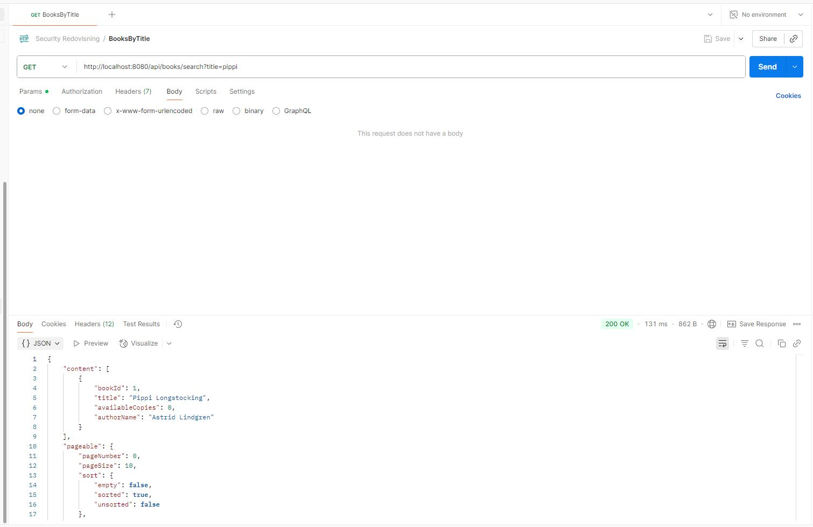  

### Se alla böcker - öppen för alla
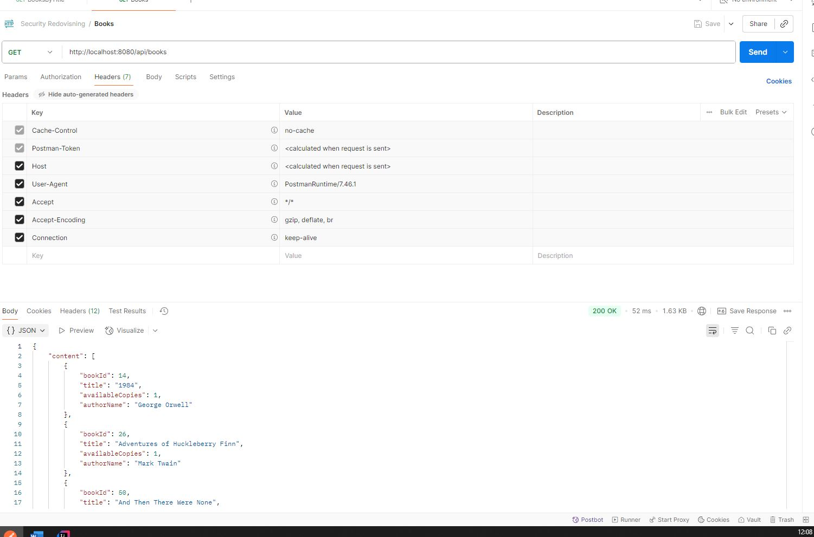

### Get allas lån 401 unauthorized - måste logga in
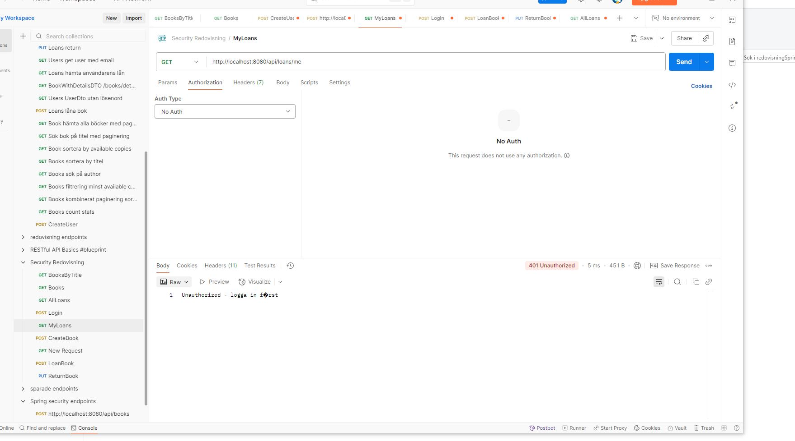  

### skapa användare - öppen för alla
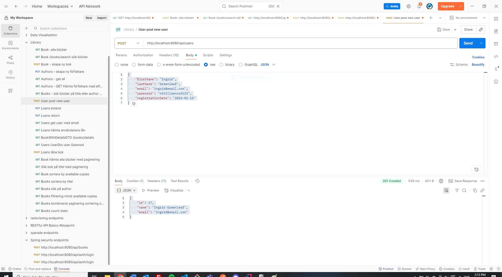  

### Ogiltiga inloggningsuppgifter
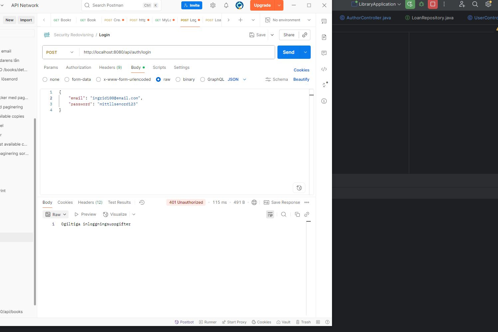  

### Too many requests - kontot låses i 15 min efter 5 försök.
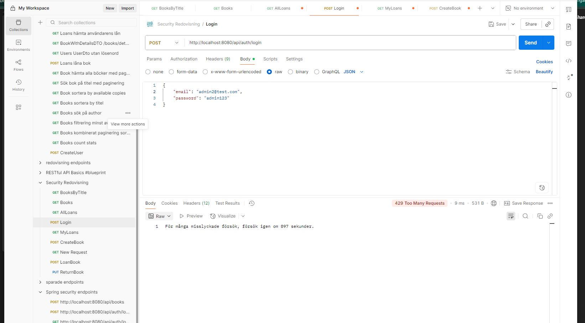

### Logga in som User - 200 ok
  

### Se egna lån som user - 200 ok
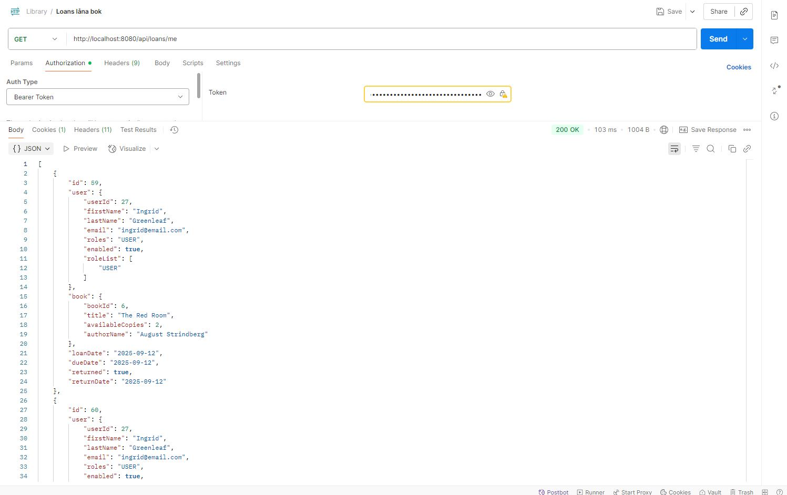  

### Se allas lån som user - obehörig - 403 forbidden 
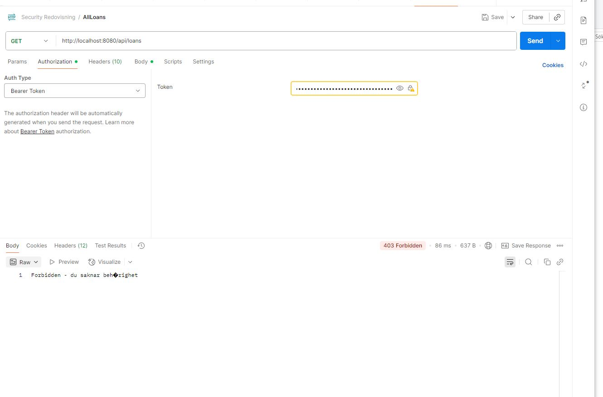  

### Se alla lån som User -  
Jag hade lite problem med att få rätt felkod, fick först 401 även som inloggad,  
Löste det med exception handler i securityconfig
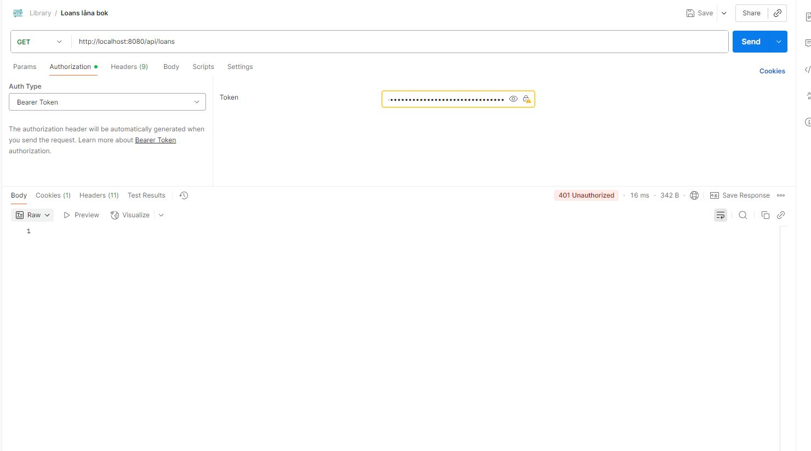  

### User kan inte se andra users uppgifter
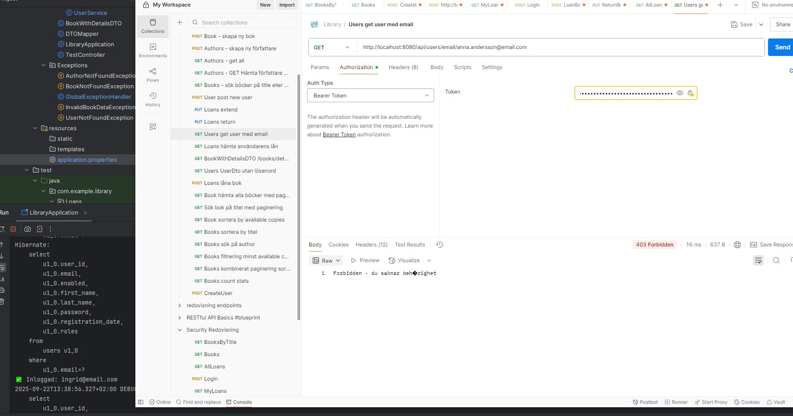  

### Logout - 204 no content och token blacklistas
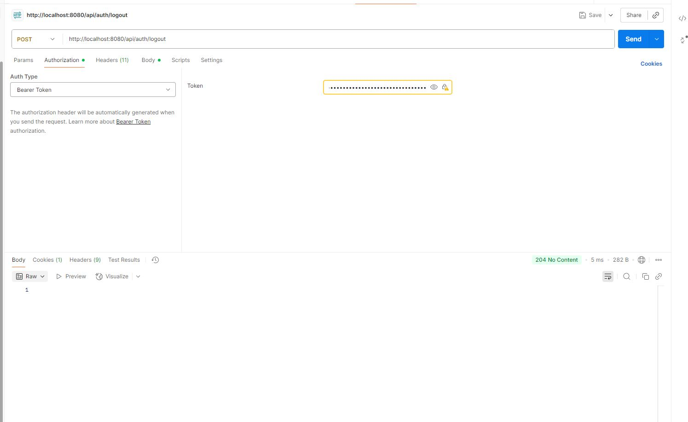

### Admin kan se allas lån
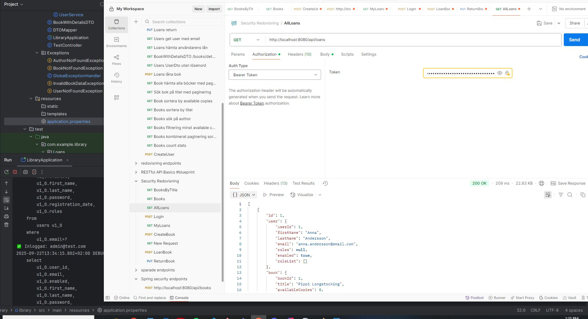  

### Admin kan se users uppgifter
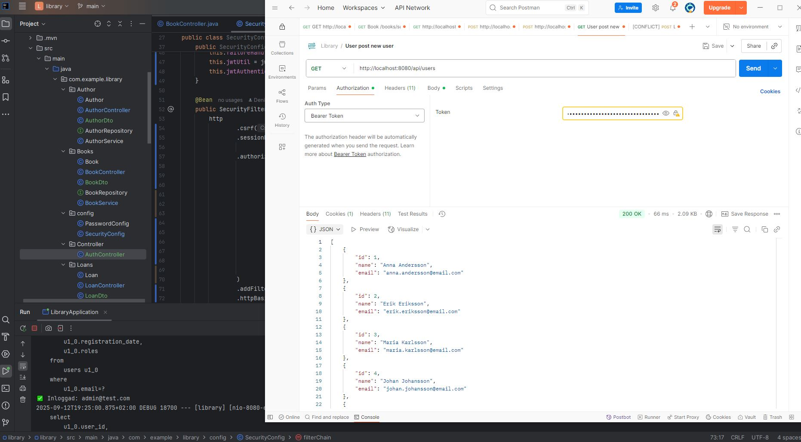  

### Admin kan skapa bok eller författare (users = obehörig)
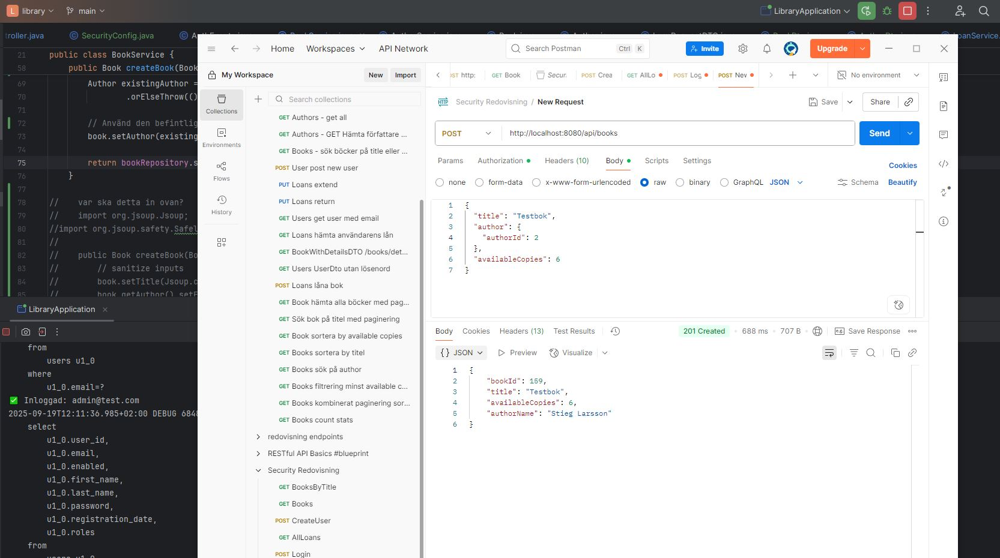

### Admin och user kan låna bok som inloggade
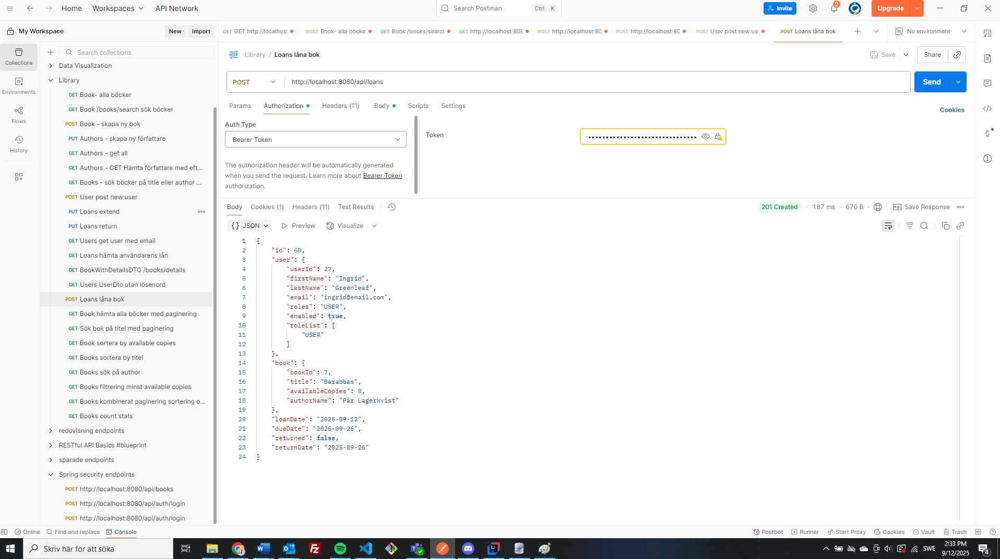

### Säkra headers
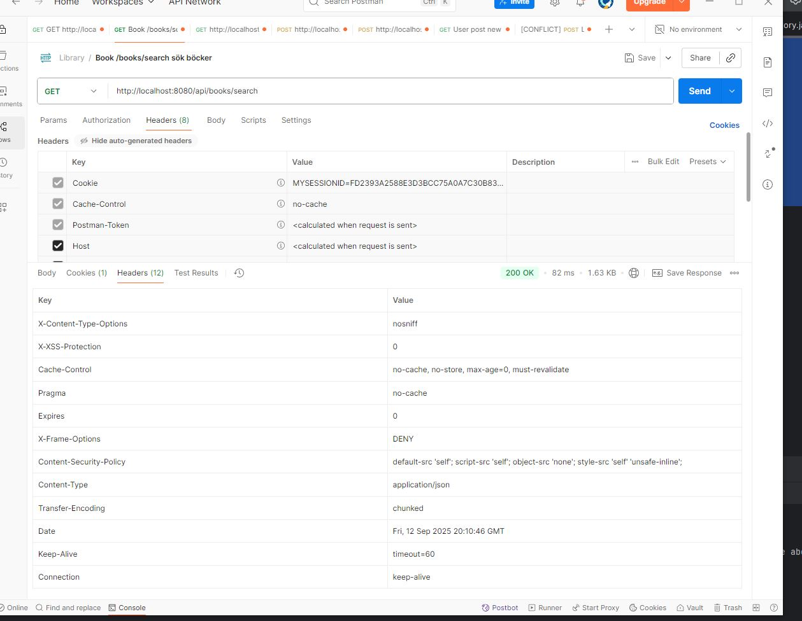  

### Session 

